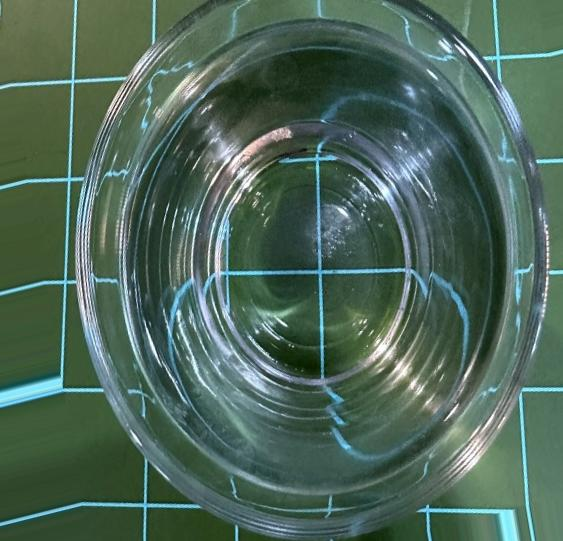

# Microplastic Detection Using CNN

This repository contains a deep learning-based solution for detecting microplastics in images using a Convolutional Neural Network (CNN). The project is focused on analyzing images to identify the presence of microplastics, employing data preprocessing, augmentation techniques, and a CNN architecture for classification.

---

## Project Overview

Plastic pollution has emerged as a critical environmental issue, with microplastics posing significant threats to marine life and ecosystems. This project leverages the power of deep learning to address this problem by detecting microplastics in image data. The model is trained on labeled datasets to distinguish microplastics from other materials, enabling automated identification in diverse scenarios.

---

## Features of This Repository

### Data Preprocessing

- **Loading the Dataset**:
  - The dataset contains labeled images of microplastics and non-microplastics, formatted into train and test splits.
- **Normalization**:
  - Pixel values are normalized to ensure uniform data scaling for improved model performance.
- **Resizing**:
  - All images are resized to a standard dimension suitable for CNN input, ensuring consistency during training.
  - {: width="300px"}

  - 


### Data Augmentation

To enhance model generalization and prevent overfitting, data augmentation is applied. Augmentation techniques include:

- **Rotation**: Randomly rotating images.
- **Flipping**: Horizontal and vertical flips.
- **Zooming**: Random zoom-in transformations.
- **Shifting**: Adjusting image position with random width and height shifts.

### Model Architecture

The CNN architecture is designed for image classification with multiple convolutional, pooling, and fully connected layers.

- **Layers**:
  - **Convolutional Layers**: Extract spatial features from input images.
  - **Max-Pooling Layers**: Downsample feature maps to reduce dimensionality.
  - **Dropout Layers**: Prevent overfitting by randomly disabling neurons during training.
  - **Dense Layers**: Perform high-level classification based on extracted features.
- **Activation Functions**:
  - **ReLU (Rectified Linear Unit)** is used for non-linearity.
  - **Softmax** is used in the output layer for multi-class classification.

### Model Training

- The training phase includes splitting the dataset into training and validation sets.
- **Loss Function**:
  - A categorical cross-entropy loss function is used for multi-class classification.
- **Optimizer**:
  - The Adam optimizer ensures efficient gradient-based optimization.
- Training is performed over multiple epochs to minimize the loss and improve accuracy.

### Evaluation

- Model performance is evaluated on the test dataset.
- Metrics such as **accuracy**, **precision**, **recall**, and **F1-score** are computed to assess model effectiveness.
- **Visualizations**:
  - Confusion matrices and loss/accuracy graphs are generated for in-depth analysis.

### Visualization

- **Data Augmentation Effects**:
  - The impact of data augmentation is visualized to ensure transformations are applied correctly.
- **Training and Validation Plots**:
  - Loss and accuracy plots are included to track model performance.

### Deployment

The trained model is saved and can be deployed for real-world applications, such as analyzing new images for microplastic detection.

---

## Installation and Usage

### Clone the Repository

```bash
git clone https://github.com/yourusername/microplastic-detection.git
cd microplastic-detection
pip install -r requirements.txt
